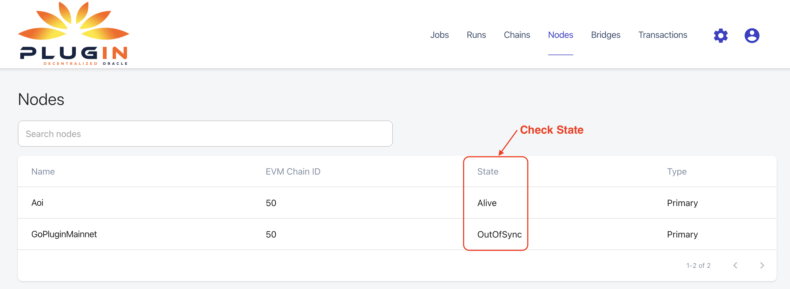
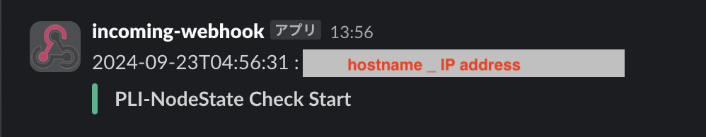
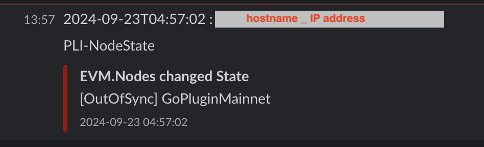
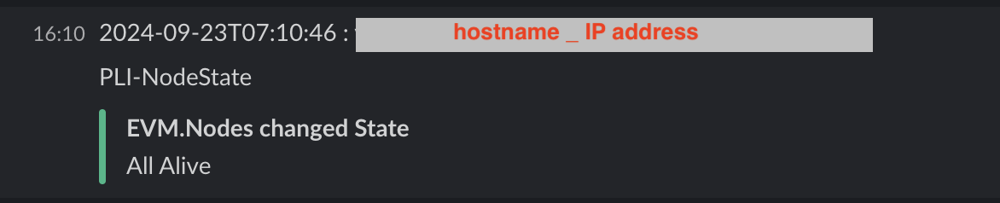

# 機能概要
このツールはPlugin NodeのRPC/WS通信の状態をチェックし、エラーが発生している場合にSlackに通知します。<br>
RPC/WS通信状態はダッシュボードの"Nodes"に表示されます。<br>

"Alive"以外の状態を検知した場合に通知します。<br>
<br>
このツールでは、定期的にlogをチェックし状態を確認しています。（デフォルトは60秒）<br>
前回チェックした状態から変更がない限り（エラーが出続けていたとしても）再度通知することはありません。<br>
状態に変化があった場合のみ通知されます。<br>

# 前提
## Slack
SlackのIncoming Webhooks機能を使うため、Webhook URLを取得する必要があります。<br>
Slackの登録方法は以下を参照してください。<br>
https://qiita.com/11ppm/private/c23f1bf19043fa6e3afb

## jq
logからNodeの状態をJSONで取得し編集するために、```jq```パッケージを利用しています。<br>
jqをインストールしてください。
```
sudo apt install jq
```

## pm2
監視の永続化のため、pm2を用います。<br>
Plugin Nodeを実行している環境ではすでにインストール済みのため、追加のインストールはありません。

# 使い方
## リポジトリのクローン
```
git clone https://github.com/AoiToSouma/nodeStateCheckPli.git
```
```
cd nodeStateCheckPli
chmod +x *.sh
```

## 設定値の編集
環境に合わせて下記の設定値を変更します。<br>
- SLACK_WEBHOOK_URL : Slack通知のためのWebhook URL
- POLLING_INTERVAL : 監視間隔（デフォルトは60秒）
```
nano nodeStateCheckPli.sh 
```

## 実行
```
pm2 start nodeStateCheckPli.sh
```
```
pm2 save
```
- 監視スタート

- エラーが発生した場合

- エラーが復旧した場合

